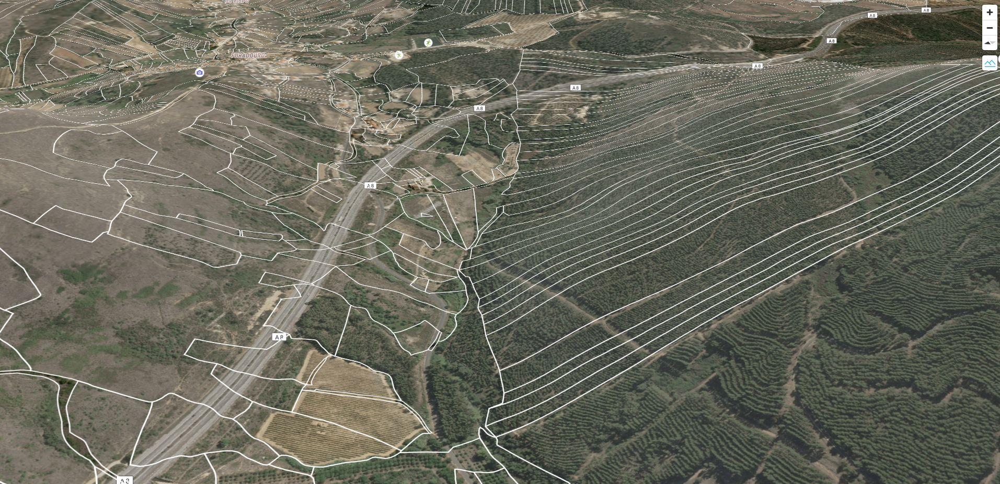

# 🗺️ Portugal - Cadastral Map 🗺️

https://pmaf.github.io/mapa

## 📝 Description
Cadastral map of Portugal using government open data sources.\
This covers both [RGG](https://dados.gov.pt/pt/datasets/representacao-grafica-georreferenciada/) (Representação Gráfica Georreferenciada) and [Cadastro Predial](https://dados.gov.pt/pt/datasets/cadastro-predial/).\
For the administrative limits (districts, municipalities, parishes) we use [CAOP 2023](https://dados.gov.pt/pt/datasets/carta-administrativa-oficial-de-portugal-caop2023-continente/) (Carta Administrativa Oficial de Portugal).

## 🚀 Features
✅ See both RGG and Cadastro Predial\
✅ 3D terrain\
🔜 Ruler for parcel measurements\
🔜 Parcel information (area, identifier, etc.)\
(More?)
